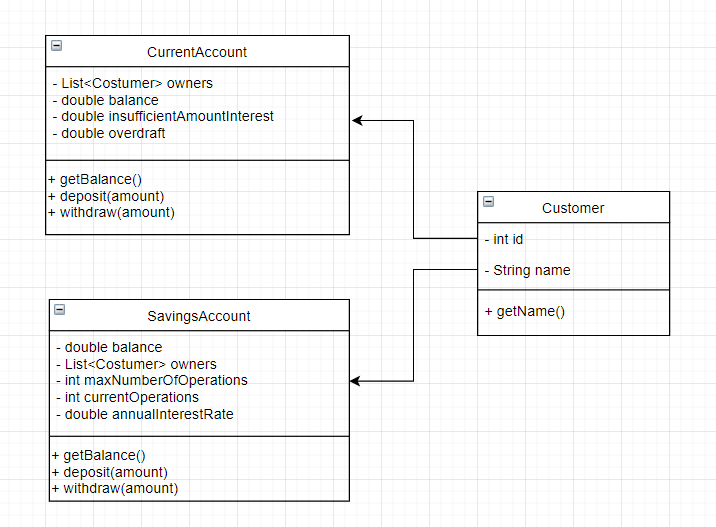
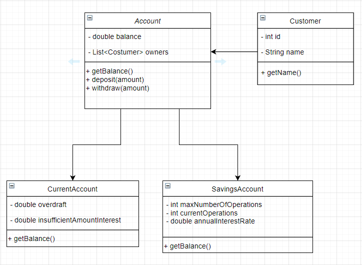

# Java Skills Baseline

## GIT basic commands

### 1.Introduction
What is GIT?

GIT is a software for tracking changes in any set of files, usually used for
coordinating work among programmers collaboratively developing source code
software development. Its goals include speed, data integrity, and support for
distributed, non-linear workflows (thousands of parallel branches running on
different systems).

### 2. Windows basic commands

cd [destino] change directory

cd  …/ goes back

dir shows the directories in the current position

cls clear screen

mkdir [directory_name] makes a directory

rmdir [directory_name] removes a directory

del [file_name] deletes a file

### 3. Key Concepts

1. Repository:

   Project directory where all the files and all their historical versions are located

2. Revision:

   Is a certain version of a project.

3. Commit:

   Action by which the changes we made in the computer are persisted in the repository.

4. Staging:

   It is a loading area where you can decide what is going to be saved in the next
   commit and what is going to be ignored.

### 4. GIT basic commands

1. git init

   Initializes GIT in our project.

2. git clone [URL]

   It allows us to connect to a server and download a copy of the project in our computer.

3. git remote add origin [URL]

   When we already initialized a GIT repository, so we don't want to clone the repository cuz It already exists. We use
   this command to connect it.

4. git pull

   Downloads new changes.

5. git push

   It Uploads changes in the server, so this way shares them  and makes a back up of the data.

6. git status

   It shows the status of our remote copy.

7. git add [file_name]

   Adds the file to the staging area.

8. git add -A / git add .

   Adds all the files to the staging area.

9. git commit -m "some message"

   Creates a new revision. -m (message) is the title of the changes.

10. git log

    It allows us to watch the historic versions of the project. It shows in cronological order (newest at the top & the
    latest at the bottom) all the revisions made. With the date, the author and a description.

11. git log --oneline

    Shows more history than git log, but is less detailed.

12. git log -p

    It also shows who modified and when modified the project and the exact changes in detail.

13. git log -- [file_name] (warning, there is a space between -- & [file_name])

    Shows the changes of an specific file.

14. git diff

    Shows the changes of the files.

15. git branch

    Creates a new branch.

16. git merge [branch_name]

    Merges two branches.

17. git branch -d [branch_name]

    Deletes a branch

18. git checkout [branch_name]

    Allows us to change between different branches.

19. git checkout [revision_number]

    Takes us to the revision of the specified number.

20. git checkout master

    Takes us to the latest revision.

21. git checkout --[file_name]

    Ignore the changes of a file in the staging area. This way we can control the changes for the next revision.

22. git checkout .

    Undoes all the changes of a revision.

### 5. Good Practices

1. Make commits frequently. This way they are easier to patch or revert, and it helps us to work in a more organized way.

2. Never commit work in progress.

## OOP

### 1. Introduction

Object-oriented programming (OOP) is a programming paradigm based on the concept of "objects". Objects can have attributes,
methods (witch will determine the behaviour of the object) and relations (with other objects).

It differs from other programming paradigms in tha we have abstractions or encapsulations that allows us to use the program
without necessarily having to know all the details in how the algorithm works.

### 2. Classes and Objects

- What's a class?

  A class is like a template that we can use to instanciate Objects using constructors.

Example:

    public class person {
        private String name;  
        private String lastname;
        
        public person () {} //Constructor
        public person (String name,String lastname) {
            this.name = name;
            this.lastname = lastname;
        }
        
        public void setName(String name) {
            this.name = name;
        }

        public void setLastname(String name) {
            this.name = name;
        }
    }

- Constructors

  They are used to the constructors in a class to create objects.

- Destructors

  They are used to freeing specific resources that objects acquired through their life cycle (For example memory).

- Instance method
  We need to instantiate an object in order to call them.

- Characteristics of methods

  Objects have a state, a performance (dictated by the instance methods and class methods) and references (characteristic
  or attribute that refers it unequivocally)

- Relationships between objects:

1.  Association: Objects may exist, and they have a completely independent life cycle

2. Aggregation: Is has a collaboration of the type "has a"

3. Compound: One object stops existing when the other stops existing

### 3. OOP Characteristics

1. Abstraction

   It's to take the most important aspects of the model we are trying to abstract and take those attributes by taking
   the context into consideration.

2. Encapsulation

   It's to save the performance of these objects within themselves and expose just the important and interesting factors
   that other objects want to know about them, or the ones who are interested in communicating with un within the model. So
   we will control the encapsulation level through access, the private and public level of the method or attribute and also
   through the performance within the methods.

3. Modularity

   It is the process of decomposing a problem (program) into a set of modules to reduce the overall complexity of
   the problem. We want the modules to be compact but tightly coupled. This means that we don't want modules depending on
   other modules.

4. Hierarchy inside of classes

   4.1 "Is a":

   It refers to a class and subclass. For example if we have a Flower Class the subclass would be a Rose Class,
   or a Daisy Class.

   4.2 "It is a part of":

   Here we are talking about a composition. We have a class that is going to be compound by other
   classes. Following the example of the flowers, we have the Flower Class that has particular components, there is the Petal
   Class, the Leaf and the Stem Class, those, at the same time, will be other objects that make the flower

5. Inheritance

   This is when we have a class which is the parent or superclass, and it's kid classes or subclasses. Kid classes are
   going to inherit from the parent class, the behaviour that is already defined in that class but at the same time, the kids
   may have specific behaviours for each specific class.

   The inheritance can be:

    - Simple: There is only one superclass.
    - Multiple: There can be multiple superclasses.
    - Multi-level: A derived class can be created from another derived class.
    - Hierarchical: More than one derived classes can be created from a single base class and further child classes act as
      parent classes for more than one child classes (kind of like branches on a tree).
    - Hybrid classes: This is combination of more than one inheritance.

6. Abstract classes and Interfaces

    - Abstract Classes:

      Abstract classes may exist without the need to instantiate them or create objects that belong to them, so we have
      a word that distinguish them "abstract", and they can exist without having another purpose.

    - Interface:

      An interface is a contract where we define certain methods, and they will be each classes that implements the
      interface will also implement that particular method. Interface don't have performance or logic incorporated.

7. Polymorphism

   It means "when something takes different shapes". When related with OOP, this paradigm give us the possibility of having
   several behaviours depending on the instance this method is implementing

8. Generalization y Specification

    - Generalization is finding witch performance and attributes are recurring like finding patterns throughout the
      model or problem.

    - Specialization is finding the peculiar thing of each of the objects we are working with.

### 3. Modeling Example

Now we're going to look an example of modelling a class diagram which we're then going to develop with a behavior that
we are going to apply some logic.

#### Current & Savings Accounts (in relation to a customer)

In this example we have customers and two types of counts. The current and savings accounts, which they have different
behaviors. While both accounts have a balance,the savings account has a limit to how much we can withdraw daily from
that account. Meanwhile, in the current account we can withdraw without a limit, and we can even exceed the balance.

With this context, so following the specialization concept, We want to constrain the problem as much as possible,
so it's easier to solve the problem. We will only focus in three classes. The customer class, the savings account class,
and the current account class.

If we apply the generalization process we can see that within the diagram that both SavingsAccount & CurrentAccount have
some standards performances, that can be compatible with a particular abstract class name Account.

With these diagrams we can create the classes and they'll look like this:

    public class Customer {
        private int id;
        private String name;

        public Customer() {
            name = default;
        }
        public Customer(String name) {
            this.name = name;
        }
        
        public String getName(){
            return name;

        }
    }

    public abstract class Account {
        protected double balance;
        protected List<Customer> owners;

        public Account (Collection<Customer> owners) {
            this.owners = new ArrayList<Customer>();
            balance = 0;

            for (Customer owner : owners) {
                this.owners.add(owner);
            }
        }
        
        public double getBalance(){
            return balance;
        }

        public void deposit(double amount) {
            balance += monto;
        }

        public abstract double withdraw(double amount);

    }

    public class CurrentAccount extends Account {
        private double overdraft;
        private double insufficientAmountInterest;

        public CurrentAccount (List<Customer> owners, double overdraft, double insufficientAmountInterest) {
            super(owners);
            this.overdraft = overdraft;
            this.insufficientAmountInterest = insufficientAmountInterest;
        }
        
        public double withdraw (double amount) {
            if (balance >= amount) {
                balance -= amount;
                return amount;
            } else if ((amount - balance) <= overdraft {
                balance -= amount + insufficientAmountInterest;
                return amount;
            } else {
                return 0
            }
        }

    }

    public class SavingsAccount extends Account {
        private int maxNumberOfOperations;
        private int currentOperations;
        private double annualInterestRate;

        public SavingsAccount(List<Customer> owners, int maxNumberOfOperations, double annualInterestRate) {
            super(owners);
            this maxNumberOfOperations = maxNumberOfOperations;
            this.annualInterestRate = double annualInterestRate;
            currentOperations = 1;
        }

        public double withdraw(double amount) {
            if (currentOperations <= maxNumberOfOperations) {
                if (balance >= amount) {
                    balance -= amount;
                    currentOperations += 1;

                    return amount;
                }
            }
        }
    }

### 4. Design Patterns

Design Patterns are reusable solution to a commonly occurring problem within a given context in software design.
They are like a description or template for how to solve a problem that can be used in many different situations.

- Creational patterns

  Creational patterns are the ones that allows us to create new instances inside our program in a reusable and
  cleaner way. Some of these patterns are:

    - Builder: Separate the construction of a complex object from its representation, allowing the same construction
      process to create various representations.

    - Singleton: Ensure a class has only one instance, and provide a global point of access to it.

    - Abstract Factory: Provide an interface for creating families of related or dependent objects without specifying
      their concrete classes.

    - Factory method: Define an interface for creating a single object, but let subclasses decide which class to
      instantiate. Factory Method lets a class defer instantiation to subclasses.

    - Prototype: Specify the kinds of objects to create using a prototypical instance, and create new objects from
      the 'skeleton' of an existing object, thus boosting performance and keeping memory footprints to a minimum.

- Structural patterns

  Structural patters propose certain conventions in the assembly of structures that give us possible solutions to problems
  that other programmer have solved and also propose a way of good practice for a clean and reusable code. Some of these
  are:

    - Bridge: Decouple an abstraction from its implementation allowing the two to vary independently.

    - Facade: Provide a unified interface to a set of interfaces in a subsystem. Facade defines a higher-level
      interface that makes the subsystem easier to use.

    - Composite: Compose objects into tree structures to represent part-whole hierarchies. Composite lets clients treat
      individual objects and compositions of objects uniformly.

    - Proxy: Provide a surrogate or placeholder for another object to control access to it.

    - flyweight: Use sharing to support large numbers of similar objects efficiently.

- Behavioural patterns

  Behavioural patterns  are strategies we can implement in the communication between different modules or classes.
  Some of these are:

    - Strategy: Define a family of algorithms, encapsulate each one, and make them interchangeable. Strategy lets the
      algorithm vary independently from clients that use it.

    - Iterator: Provide a way to access the elements of an aggregate object sequentially without exposing its
      underlying representation.

    - Template: Define the skeleton of an algorithm in an operation, deferring some steps to subclasses.
      Template method lets subclasses redefine certain steps of an algorithm without changing the algorithm's structure.

    - Visitor: 	Represent an operation to be performed on the elements of an object structure. Visitor lets a new
      operation be defined without changing the classes of the elements on which it operates.

    - Observer: Define a one-to-many dependency between objects where a state change in one object results in all its
      dependents being notified and updated automatically.

    - Memento: Without violating encapsulation, capture and externalize an object's internal state allowing the object
      to be restored to this state later.

    - Chain of responsibility: Avoid coupling the sender of a request to its receiver by giving more than one object a
      chance to handle the request. Chain the receiving objects and pass the request along the chain until an object handles it.

    - State: Allow an object to alter its behavior when its internal state changes. The object will appear to change
      its class.

### 5. SOLID principles

#### What is SOLID?

SOLID principles are some thoughts or lineaments which allow us to have a code much cleaner, more maintainable and
comprehensible to others. SOLID stands for:

- Single Responsibility
- Open-close
- Liskov substitution
- Interface segregation
- Dependency injection

#### Single Responsibility principle
This means that every module must have one and only one responsibility.

#### Open-close principle
We will be open to extend but close to modify.

#### Liskov substitution principle
If S is a subtype of T, then objects of type T may be replaced with objects of type S without altering any of the
desirable properties of the program.

#### Interface Segregation principle
This principle states that no client should be forced to depend on methods it does not use.

#### Dependency inversion principle
The principle states:

- High-level modules should not depend on low-level modules. Both should depend on abstractions (like interfaces).
- Abstractions should not depend on details. Details (concrete implementations) should depend on abstractions.

### 6. OOP principles

#### KISS
KISS (Keep it simple). Always think in the simplest solution you can come with and avoid complexity or intricate code.

#### DRY
DRY (Don't repeat yourself) Try to reuse the code as much as possible and don't copy-paste as much, repeating and
propagating errors or making the code hart to maintain.

#### YAGNI
YAGNI (you aren't gonna need it) It's thinking about the thing we aren't using and deleting them form the code.

#### GRASP
GRASP (general responsibility assignment) which is a group of concepts that we've already seen. These are good practices
we've already used, and we group them under a single concept to describe characteristics that have systems.

## Gradle Basics

### 1. Introduction
Gradle is a Groovy-based build management system designed specifically for building Java-based projects.

### 2. Building Blocks – Projects and Tasks
In Gradle, Builds consist of one or more projects and each project consists of one or more tasks.
A project in Gradle can be assembling a jar, war or even a zip file.

A task is a single piece of work. This can include compiling classes, or creating and publishing Java/web archives.

A simple task can be defined as:

    task hello {
        doLast {
            println 'Lauta'
        }
    }
If we execute above task using gradle -q hello command from the same location where build.gradle resides, we should see
the output in the console.

#### 2.1. Tasks
Gradle's build scripts are nothing but Groovy:

    task toLower {
        doLast {
            String someString = 'HELLO WORLD IM LAUTA'
            println "Original: "+ someString
            println "Lower case: " + someString.toLowerCase()
        }
    }
We can define tasks that depend on other tasks. Task dependency can be defined by passing the dependsOn: taskName argument in a task definition:

    task helloGradle {
        doLast {
            println 'Hello Gradle!'
        }
    }

    task fromBaeldung(dependsOn: helloGradle) {
        doLast {
            println "I'm from Baeldung"
        }
    }

#### 2.2. Adding Behavior to a Task
We can define a task and enhance it with some additional behaviour:

    task helloBaeldung {
        doLast {
            println 'I will be executed second'
        }
    }

    helloBaeldung.doFirst {
        println 'I will be executed first'
    }

    helloBaeldung.doLast {
        println 'I will be executed third'
    }

    helloBaeldung {
        doLast {
            println 'I will be executed fourth'
        }
    }

doFirst and doLast add actions at the top and bottom of the action list, respectively, and can be defined multiple times
in a single task.

#### 2.3. Adding Task Properties
We can also define properties:

    task ourTask {
        ext.theProperty = "theValue"
    }
Here, we're setting “theValue” as theProperty of the ourTask task.