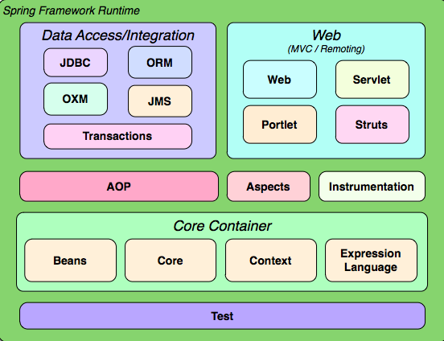
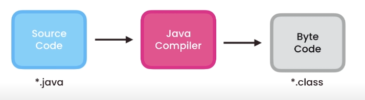
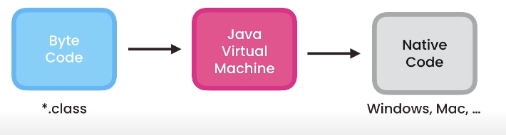
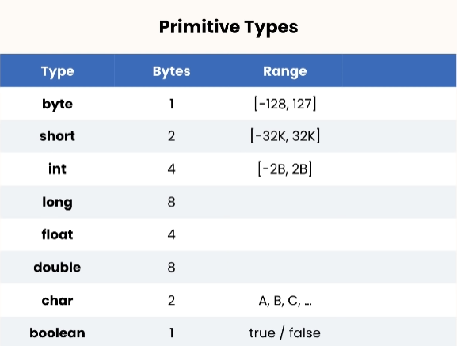
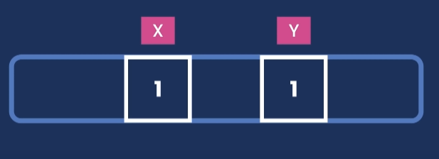
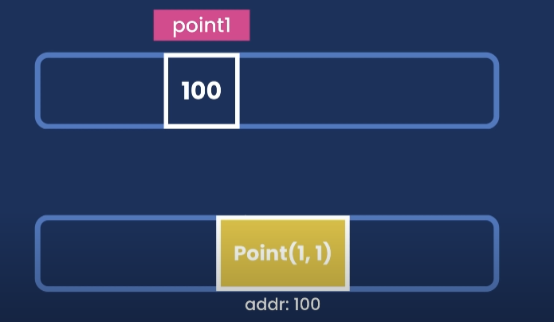
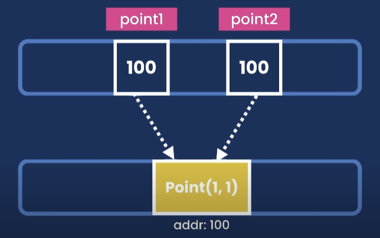
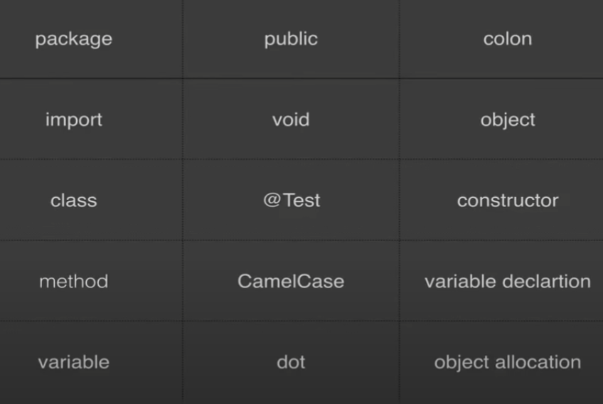
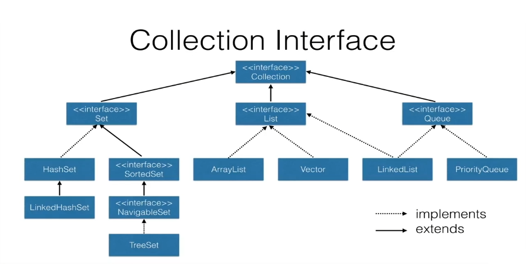

# Java Skills Baseline

## GIT basic commands

### 1.Introduction
What is GIT?

GIT is a software for tracking changes in any set of files, usually used for
coordinating work among programmers collaboratively developing source code
software development. Its goals include speed, data integrity, and support for
distributed, non-linear workflows (thousands of parallel branches running on
different systems).

### 2. Windows basic commands

cd [destino] change directory

cd  …/ goes back

dir shows the directories in the current position

cls clear screen

mkdir [directory_name] makes a directory

rmdir [directory_name] removes a directory

del [file_name] deletes a file

### 3. Key Concepts

1. Repository:

   Project directory where all the files and all their historical versions are located

2. Revision:

   Is a certain version of a project.

3. Commit:

   Action by which the changes we made in the computer are persisted in the repository.

4. Staging:

   It is a loading area where you can decide what is going to be saved in the next
   commit and what is going to be ignored.

### 4. GIT basic commands

1. git init

   Initializes GIT in our project.

2. git clone [URL]

   It allows us to connect to a server and download a copy of the project in our computer.

3. git remote add origin [URL]

   When we already initialized a GIT repository, so we don't want to clone the repository cuz It already exists. We use
   this command to connect it.

4. git pull

   Downloads new changes.

5. git push

   It Uploads changes in the server, so this way shares them  and makes a back up of the data.

6. git status

   It shows the status of our remote copy.

7. git add [file_name]

   Adds the file to the staging area.

8. git add -A / git add .

   Adds all the files to the staging area.

9. git commit -m "some message"

   Creates a new revision. -m (message) is the title of the changes.

10. git log

    It allows us to watch the historic versions of the project. It shows in cronological order (newest at the top & the
    latest at the bottom) all the revisions made. With the date, the author and a description.

11. git log --oneline

    Shows more history than git log, but is less detailed.

12. git log -p

    It also shows who modified and when modified the project and the exact changes in detail.

13. git log -- [file_name] (warning, there is a space between -- & [file_name])

    Shows the changes of an specific file.

14. git diff

    Shows the changes of the files.

15. git branch

    Creates a new branch.

16. git merge [branch_name]

    Merges two branches.

17. git branch -d [branch_name]

    Deletes a branch

18. git checkout [branch_name]

    Allows us to change between different branches.

19. git checkout [revision_number]

    Takes us to the revision of the specified number.

20. git checkout master

    Takes us to the latest revision.

21. git checkout --[file_name]

    Ignore the changes of a file in the staging area. This way we can control the changes for the next revision.

22. git checkout .

    Undoes all the changes of a revision.

### 5. Good Practices

1. Make commits frequently. This way they are easier to patch or revert, and it helps us to work in a more organized way.

2. Never commit work in progress.

## OOP

### 1. Introduction

Object-oriented programming (OOP) is a programming paradigm based on the concept of "objects". Objects can have attributes,
methods (witch will determine the behaviour of the object) and relations (with other objects).

It differs from other programming paradigms in tha we have abstractions or encapsulations that allows us to use the program
without necessarily having to know all the details in how the algorithm works.

### 2. Classes and Objects

- What's a class?

  A class is like a template that we can use to instanciate Objects using constructors.

Example:

    public class person {
        private String name;  
        private String lastname;
        
        public person () {} //Constructor
        public person (String name,String lastname) {
            this.name = name;
            this.lastname = lastname;
        }
        
        public void setName(String name) {
            this.name = name;
        }

        public void setLastname(String name) {
            this.name = name;
        }
    }

- Constructors

  They are used to the constructors in a class to create objects.

- Destructors

  They are used to freeing specific resources that objects acquired through their life cycle (For example memory).

- Instance method
  We need to instantiate an object in order to call them.

- Characteristics of methods

  Objects have a state, a performance (dictated by the instance methods and class methods) and references (characteristic
  or attribute that refers it unequivocally)

- Relationships between objects:

1.  Association: Objects may exist, and they have a completely independent life cycle

2. Aggregation: Is has a collaboration of the type "has a"

3. Compound: One object stops existing when the other stops existing

### 3. OOP Characteristics

1. Abstraction

   It's to take the most important aspects of the model we are trying to abstract and take those attributes by taking
   the context into consideration.

2. Encapsulation

   It's to save the performance of these objects within themselves and expose just the important and interesting factors
   that other objects want to know about them, or the ones who are interested in communicating with un within the model. So
   we will control the encapsulation level through access, the private and public level of the method or attribute and also
   through the performance within the methods.

3. Modularity

   It is the process of decomposing a problem (program) into a set of modules to reduce the overall complexity of
   the problem. We want the modules to be compact but tightly coupled. This means that we don't want modules depending on
   other modules.

4. Hierarchy inside of classes

   4.1 "Is a":

   It refers to a class and subclass. For example if we have a Flower Class the subclass would be a Rose Class,
   or a Daisy Class.

   4.2 "It is a part of":

   Here we are talking about a composition. We have a class that is going to be compound by other
   classes. Following the example of the flowers, we have the Flower Class that has particular components, there is the Petal
   Class, the Leaf and the Stem Class, those, at the same time, will be other objects that make the flower

5. Inheritance

   This is when we have a class which is the parent or superclass, and it's kid classes or subclasses. Kid classes are
   going to inherit from the parent class, the behaviour that is already defined in that class but at the same time, the kids
   may have specific behaviours for each specific class.

   The inheritance can be:

    - Simple: There is only one superclass.
    - Multiple: There can be multiple superclasses.
    - Multi-level: A derived class can be created from another derived class.
    - Hierarchical: More than one derived classes can be created from a single base class and further child classes act as
      parent classes for more than one child classes (kind of like branches on a tree).
    - Hybrid classes: This is combination of more than one inheritance.

6. Abstract classes and Interfaces

    - Abstract Classes:

      Abstract classes may exist without the need to instantiate them or create objects that belong to them, so we have
      a word that distinguish them "abstract", and they can exist without having another purpose.

    - Interface:

      An interface is a contract where we define certain methods, and they will be each classes that implements the
      interface will also implement that particular method. Interface don't have performance or logic incorporated.

7. Polymorphism

   It means "when something takes different shapes". When related with OOP, this paradigm give us the possibility of having
   several behaviours depending on the instance this method is implementing

8. Generalization y Specification

    - Generalization is finding witch performance and attributes are recurring like finding patterns throughout the
      model or problem.

    - Specialization is finding the peculiar thing of each of the objects we are working with.

### 3. Modeling Example

Now we're going to look an example of modelling a class diagram which we're then going to develop with a behavior that
we are going to apply some logic.

#### Current & Savings Accounts (in relation to a customer)

In this example we have customers and two types of counts. The current and savings accounts, which they have different
behaviors. While both accounts have a balance,the savings account has a limit to how much we can withdraw daily from
that account. Meanwhile, in the current account we can withdraw without a limit, and we can even exceed the balance.

With this context, so following the specialization concept, We want to constrain the problem as much as possible,
so it's easier to solve the problem. We will only focus in three classes. The customer class, the savings account class,
and the current account class.

If we apply the generalization process we can see that within the diagram that both SavingsAccount & CurrentAccount have
some standards performances, that can be compatible with a particular abstract class name Account.

With these diagrams we can create the classes and they'll look like this:

    public class Customer {
        private int id;
        private String name;

        public Customer() {
            name = default;
        }
        public Customer(String name) {
            this.name = name;
        }
        
        public String getName(){
            return name;

        }
    }

    public abstract class Account {
        protected double balance;
        protected List<Customer> owners;

        public Account (Collection<Customer> owners) {
            this.owners = new ArrayList<Customer>();
            balance = 0;

            for (Customer owner : owners) {
                this.owners.add(owner);
            }
        }
        
        public double getBalance(){
            return balance;
        }

        public void deposit(double amount) {
            balance += monto;
        }

        public abstract double withdraw(double amount);

    }

    public class CurrentAccount extends Account {
        private double overdraft;
        private double insufficientAmountInterest;

        public CurrentAccount (List<Customer> owners, double overdraft, double insufficientAmountInterest) {
            super(owners);
            this.overdraft = overdraft;
            this.insufficientAmountInterest = insufficientAmountInterest;
        }
        
        public double withdraw (double amount) {
            if (balance >= amount) {
                balance -= amount;
                return amount;
            } else if ((amount - balance) <= overdraft {
                balance -= amount + insufficientAmountInterest;
                return amount;
            } else {
                return 0
            }
        }

    }

    public class SavingsAccount extends Account {
        private int maxNumberOfOperations;
        private int currentOperations;
        private double annualInterestRate;

        public SavingsAccount(List<Customer> owners, int maxNumberOfOperations, double annualInterestRate) {
            super(owners);
            this maxNumberOfOperations = maxNumberOfOperations;
            this.annualInterestRate = double annualInterestRate;
            currentOperations = 1;
        }

        public double withdraw(double amount) {
            if (currentOperations <= maxNumberOfOperations) {
                if (balance >= amount) {
                    balance -= amount;
                    currentOperations += 1;

                    return amount;
                }
            }
        }
    }

### 4. Design Patterns

Design Patterns are reusable solution to a commonly occurring problem within a given context in software design.
They are like a description or template for how to solve a problem that can be used in many different situations.

- Creational patterns

  Creational patterns are the ones that allows us to create new instances inside our program in a reusable and
  cleaner way. Some of these patterns are:

    - Builder: Separate the construction of a complex object from its representation, allowing the same construction
      process to create various representations.

    - Singleton: Ensure a class has only one instance, and provide a global point of access to it.

    - Abstract Factory: Provide an interface for creating families of related or dependent objects without specifying
      their concrete classes.

    - Factory method: Define an interface for creating a single object, but let subclasses decide which class to
      instantiate. Factory Method lets a class defer instantiation to subclasses.

    - Prototype: Specify the kinds of objects to create using a prototypical instance, and create new objects from
      the 'skeleton' of an existing object, thus boosting performance and keeping memory footprints to a minimum.

- Structural patterns

  Structural patters propose certain conventions in the assembly of structures that give us possible solutions to problems
  that other programmer have solved and also propose a way of good practice for a clean and reusable code. Some of these
  are:

    - Bridge: Decouple an abstraction from its implementation allowing the two to vary independently.

    - Facade: Provide a unified interface to a set of interfaces in a subsystem. Facade defines a higher-level
      interface that makes the subsystem easier to use.

    - Composite: Compose objects into tree structures to represent part-whole hierarchies. Composite lets clients treat
      individual objects and compositions of objects uniformly.

    - Proxy: Provide a surrogate or placeholder for another object to control access to it.

    - flyweight: Use sharing to support large numbers of similar objects efficiently.

- Behavioural patterns

  Behavioural patterns  are strategies we can implement in the communication between different modules or classes.
  Some of these are:

    - Strategy: Define a family of algorithms, encapsulate each one, and make them interchangeable. Strategy lets the
      algorithm vary independently from clients that use it.

    - Iterator: Provide a way to access the elements of an aggregate object sequentially without exposing its
      underlying representation.

    - Template: Define the skeleton of an algorithm in an operation, deferring some steps to subclasses.
      Template method lets subclasses redefine certain steps of an algorithm without changing the algorithm's structure.

    - Visitor: 	Represent an operation to be performed on the elements of an object structure. Visitor lets a new
      operation be defined without changing the classes of the elements on which it operates.

    - Observer: Define a one-to-many dependency between objects where a state change in one object results in all its
      dependents being notified and updated automatically.

    - Memento: Without violating encapsulation, capture and externalize an object's internal state allowing the object
      to be restored to this state later.

    - Chain of responsibility: Avoid coupling the sender of a request to its receiver by giving more than one object a
      chance to handle the request. Chain the receiving objects and pass the request along the chain until an object handles it.

    - State: Allow an object to alter its behavior when its internal state changes. The object will appear to change
      its class.

### 5. SOLID principles

#### What is SOLID?

SOLID principles are some thoughts or lineaments which allow us to have a code much cleaner, more maintainable and
comprehensible to others. SOLID stands for:

- Single Responsibility
- Open-close
- Liskov substitution
- Interface segregation
- Dependency injection

#### Single Responsibility principle
This means that every module must have one and only one responsibility.

#### Open-close principle
We will be open to extend but close to modify.

#### Liskov substitution principle
If S is a subtype of T, then objects of type T may be replaced with objects of type S without altering any of the
desirable properties of the program.

#### Interface Segregation principle
This principle states that no client should be forced to depend on methods it does not use.

#### Dependency inversion principle
The principle states:

- High-level modules should not depend on low-level modules. Both should depend on abstractions (like interfaces).
- Abstractions should not depend on details. Details (concrete implementations) should depend on abstractions.

### 6. OOP principles

#### KISS
KISS (Keep it simple). Always think in the simplest solution you can come with and avoid complexity or intricate code.

#### DRY
DRY (Don't repeat yourself) Try to reuse the code as much as possible and don't copy-paste as much, repeating and
propagating errors or making the code hart to maintain.

#### YAGNI
YAGNI (you aren't gonna need it) It's thinking about the thing we aren't using and deleting them form the code.

#### GRASP
GRASP (general responsibility assignment) which is a group of concepts that we've already seen. These are good practices
we've already used, and we group them under a single concept to describe characteristics that have systems.

## Gradle Basics

### 1. Introduction
Gradle is a Groovy-based build management system designed specifically for building Java-based projects.

### 2. Building Blocks – Projects and Tasks
In Gradle, Builds consist of one or more projects and each project consists of one or more tasks.
A project in Gradle can be assembling a jar, war or even a zip file.

A task is a single piece of work. This can include compiling classes, or creating and publishing Java/web archives.

A simple task can be defined as:

    task hello {
        doLast {
            println 'Lauta'
        }
    }
If we execute above task using gradle -q hello command from the same location where build.gradle resides, we should see
the output in the console.

#### 2.1. Tasks
Gradle's build scripts are nothing but Groovy:

    task toLower {
        doLast {
            String someString = 'HELLO WORLD IM LAUTA'
            println "Original: "+ someString
            println "Lower case: " + someString.toLowerCase()
        }
    }
We can define tasks that depend on other tasks. Task dependency can be defined by passing the dependsOn: taskName argument in a task definition:

    task helloGradle {
        doLast {
            println 'Hello Gradle!'
        }
    }

    task fromBaeldung(dependsOn: helloGradle) {
        doLast {
            println "I'm from Baeldung"
        }
    }

#### 2.2. Adding Behavior to a Task
We can define a task and enhance it with some additional behaviour:

    task helloBaeldung {
        doLast {
            println 'I will be executed second'
        }
    }

    helloBaeldung.doFirst {
        println 'I will be executed first'
    }

    helloBaeldung.doLast {
        println 'I will be executed third'
    }

    helloBaeldung {
        doLast {
            println 'I will be executed fourth'
        }
    }

doFirst and doLast add actions at the top and bottom of the action list, respectively, and can be defined multiple times
in a single task.

#### 2.3. Adding Task Properties
We can also define properties:

    task ourTask {
        ext.theProperty = "theValue"
    }
Here, we're setting “theValue” as theProperty of the ourTask task.

### 3. Managing Plugins
There are two types of plugins in Gradle.

-Script

-Binary

To benefit from an additional functionality, every plugin needs to go through two phases: resolving and applying.

- Resolving means finding the correct version of the plugin jar and adding that to the classpath of the project.

- Applying plugins is executing Plugin.apply(T) on the project.

#### 3.1. Applying Script Plugins
In the aplugin.gradle, we can define a task:

    task fromPlugin {
        doLast {
            println "I'm from plugin"
        }
    }

If we want to apply this plugin to our project build.gradle file, all we need to do is add this line to our build.gradle:

    apply from: 'aplugin.gradle'

Now, executing gradle tasks command should display the fromPlugin task in the task list.

#### 3.2. Applying Binary Plugins Using Plugins DSL
In the case of adding a core binary plugin, we can add short names or a plugin id:

    plugins {
        id 'application'
    }
Now the run task from application plugin should be available in a project to execute any runnable jar. To apply a
community plugin, we have to mention a fully qualified plugin id :

    plugins {
        id "org.shipkit.bintray" version "0.9.116"
    }
Now, Shipkit tasks should be available on gradle tasks list.The limitations of the plugins DSL are:

- It doesn't support Groovy code inside the plugins block.
- Plugins block needs to be the top level statement in project's build scripts (only buildscripts{} block is allowed
  before it).
- Plugins DSL cannot be written in scripts plugin, settings.gradle file or in init scripts.

Plugins DSL is still incubating. The DSL and other configuration may change in the later Gradle versions.

#### 3.3. Legacy Procedure for Applying Plugins
We can also apply plugins using the “apply plugin”:

    apply plugin: 'war'
If we need to add a community plugin, we have to add the external jar to the build classpath using buildscript{} block.

Then, we can apply the plugin in the build scripts but only after any existing plugins{} block:

    buildscript {
        repositories {
            maven {
                url "https://plugins.gradle.org/m2/"
            }
        }
        dependencies {
            classpath "org.shipkit:shipkit:0.9.117"
        }
    }
    apply plugin: "org.shipkit.bintray-release"

### 4. Dependency Management
   Gradle supports very flexible dependency management system, it's compatible with the wide variety of available approaches.

*Best practices for dependency management in Gradle are versioning, dynamic versioning, resolving version conflicts and 
managing transitive dependencies.*

#### 4.1. Dependency Configuration
Dependencies are grouped into different configurations. 
*A configuration has a name and they can extend each other.*

If we apply the Java plugin, we'll have compile, testCompile, runtime configurations available for grouping our dependencies. 
*The default configuration extends “runtime”.*

#### 4.2. Declaring Dependencies
Let's look at an example of adding some dependencies (Spring and Hibernate) using several different ways:

    dependencies {
        compile group: 
            'org.springframework', name: 'spring-core', version: '4.3.5.RELEASE'
        compile 'org.springframework:spring-core:4.3.5.RELEASE',
            'org.springframework:spring-aop:4.3.5.RELEASE'
        compile(
            [group: 'org.springframework', name: 'spring-core', version: '4.3.5.RELEASE'],
            [group: 'org.springframework', name: 'spring-aop', version: '4.3.5.RELEASE']
        )
        testCompile('org.hibernate:hibernate-core:5.2.12.Final') {
            transitive = true
        }
        runtime(group: 'org.hibernate', name: 'hibernate-core', version: '5.2.12.Final') {
            transitive = false
        }
    }

We're declaring dependencies in various configurations: compile, testCompile, and runtime in various formats.

Sometimes we need dependencies that have multiple artifacts. In such cases, we can add an artifact-only notations 
@extensionName (or ext in the expanded form) to download the desired artifact:

    runtime "org.codehaus.groovy:groovy-all:2.4.11@jar"
    runtime group: 'org.codehaus.groovy', name: 'groovy-all', version: '2.4.11', ext: 'jar'
Here, we added the @jar notation to download only the jar artifact without the dependencies.

To add dependencies to any local files, we can use something like this:

    compile files('libs/joda-time-2.2.jar', 'libs/junit-4.12.jar')
    compile fileTree(dir: 'libs', include: '*.jar')

*When we want to avoid transitive dependencies, we can do it on configuration level or on dependency level:*

    configurations {
        testCompile.exclude module: 'junit'
    }

    testCompile("org.springframework.batch:spring-batch-test:3.0.7.RELEASE"){
        exclude module: 'junit'
    }

### 5. Multi-Project Builds
#### 5.1. Build Lifecycle
*In the initialization phase, Gradle determines which projects are going to take part in a multi-project build.* This is
usually mentioned in settings.gradle file, which is located in the project root. Gradle also creates instances of the 
participating projects.

*In the configuration phase, all created projects instances are configured based on Gradle feature configuration on 
demand.*

In this feature, only required projects are configured for a specific task execution. This way, configuration time is 
highly reduced for a large multi-project build. This feature is still incubating.

Finally, in the execution phase, a subset of tasks, created and configured are executed. We can include code in the 
settings.gradle and build.gradle files to perceive these three phases.

In settings.gradle :

    println 'At initialization phase.'

In build.gradle :

    println 'At configuration phase.'

    task configured { println 'Also at the configuration phase.' }

    task execFirstTest { doLast { println 'During the execution phase.' } }

    task execSecondTest {
        doFirst { println 'At first during the execution phase.' }
        doLast { println 'At last during the execution phase.' }
        println 'At configuration phase.'
    }

#### 5.2. Creating Multi-Project Build
We can execute the gradle init command in the root folder to create a skeleton for both settings.gradle and build.gradle 
file.

All common configuration will be kept in the root build script:

    allprojects {
        repositories {
            mavenCentral()
        }
    }

    subprojects {
        version = '1.0'
    }

The setting file needs to include root project name and subproject name:

    rootProject.name = 'multi-project-builds'
    include 'greeting-library','greeter'

Now we need to have a couple of subproject folders named greeting-library and greeter to have a demo of a multi-project 
build. Each subproject needs to have an individual build script to configure their individual dependencies and other 
necessary configurations.

If we'd like to have our greeter project dependent on the greeting-library, we need to include the dependency in the build script of greeter:

    dependencies {
        compile project(':greeting-library')
    }

### 6. Using Gradle Wrapper
If a Gradle project has gradlew file for Linux and gradlew.bat file for Windows, we don't need to install Gradle to 
build the project. If we execute gradlew build in Windows and ./gradlew build in Linux, a Gradle distribution specified 
in gradlew file will be downloaded automatically.

If we'd like to add the Gradle wrapper to our project:

    gradle wrapper --gradle-version 4.2.1
The command needs to be executed from the root of the project. This will create all necessary files and folders to tie Gradle wrapper to the project. The other way to do the same is to add the wrapper task to the build script:

    task wrapper(type: Wrapper) {
        gradleVersion = '4.2.1'
    }
Now we need to execute the wrapper task and the task will tie our project to the wrapper. Besides the gradlew files, a wrapper folder is generated inside the gradle folder containing a jar and a properties file.

If we want to switch to a new version of Gradle, we only need to change an entry in gradle-wrapper.properties.

## Core Spring Concepts

### 1. Introduction to Spring Framework

Spring Framework is a Java platform that provides comprehensive infrastructure support for developing Java applications.
Spring handles the infrastructure so you can focus on your application.
Spring enables you to build applications from “plain old Java objects” (POJOs) and to apply enterprise services
non-invasively to POJOs. This capability applies to the Java SE programming model and to full and partial Java EE.

Examples of how you, as an application developer, can use the Spring platform advantage:
- Make a Java method execute in a database transaction without having to deal with transaction APIs.
- Make a local Java method a remote procedure without having to deal with remote APIs.
- Make a local Java method a management operation without having to deal with JMX APIs.
- Make a local Java method a message handler without having to deal with JMS APIs.

#### 1.1 Dependency Injection and Inversion of Control
Java applications -- a loose term that runs the gamut from constrained applets to n-tier server-side enterprise 
applications -- typically consist of objects that collaborate to form the application proper. Thus the objects in an 
application have dependencies on each other.

Although the Java platform provides a wealth of application development functionality, it lacks the means to organize 
the basic building blocks into a coherent whole, leaving that task to architects and developers. True, you can use 
design patterns such as Factory, Abstract Factory, Builder, Decorator, and Service Locator to compose the various 
classes and object instances that make up an application. However, these patterns are simply that: best practices given 
a name, with a description of what the pattern does, where to apply it, the problems it addresses, and so forth. 
Patterns are formalized best practices that you must implement yourself in your application.

*The Spring Framework Inversion of Control (IoC)*
component addresses this concern by providing a formalized means of 
composing disparate components into a fully working application ready for use. The Spring Framework codifies formalized 
design patterns as first-class objects that you can integrate into your own application(s). Numerous organizations and 
institutions use the Spring Framework in this manner to engineer robust, maintainable applications

#### 1.2 Modules
The Spring Framework consists of features organized into about 20 modules. These modules are grouped into Core 
Container, Data Access/Integration, Web, AOP (Aspect Oriented Programming), Instrumentation, and Test, as shown in the 
following diagram.

##### 1.2.1 Core Container
- The **Core Container** consists of the Core, Beans, Context, and Expression Language modules.
- The **Core and Beans modules** provide the fundamental parts of the framework, including the IoC and Dependency Injection 
  features. The BeanFactory is a sophisticated implementation of the factory pattern. It removes the need for 
  programmatic singletons and allows you to decouple the configuration and specification of dependencies from your 
  actual program logic.
- The **Context module** builds on the solid base provided by the Core and Beans modules: it is a means to access objects in 
a framework-style manner that is similar to a JNDI registry. The Context module inherits its features from the Beans 
module and adds support for internationalization (using, for example, resource bundles), event-propagation, 
resource-loading, and the transparent creation of contexts by, for example, a servlet container. The Context module 
also supports Java EE features such as EJB, JMX ,and basic remoting. The ApplicationContext interface is the focal 
point of the Context module.
- The **Expression Language module** provides a powerful expression language for querying and manipulating an object graph 
  at runtime. It is an extension of the unified expression language (unified EL) as specified in the JSP 2.1 
  specification. The language supports setting and getting property values, property assignment, method invocation, 
  accessing the context of arrays, collections and indexers, logical and arithmetic operators, named variables, and 
  retrieval of objects by name from Spring's IoC container. It also supports list projection and selection as well as 
  common list aggregations.

##### 1.2.2 Data Access/Integration

The Data Access/Integration layer consists of the JDBC, ORM, OXM, JMS and Transaction modules.

- The **JDBC module** provides a JDBC-abstraction layer that removes the need to do tedious JDBC coding and parsing of 
  database-vendor specific error codes.
- The **ORM module** provides integration layers for popular object-relational mapping APIs, including JPA, JDO, Hibernate, and iBatis. Using the ORM package you can use all of these O/R-mapping frameworks in combination with all of the other features Spring offers, such as the simple declarative transaction management feature mentioned previously.
- The **OXM module** provides an abstraction layer that supports Object/XML mapping implementations for JAXB, Castor, 
  XMLBeans, JiBX and XStream.
- The **Java Messaging Service (JMS) module** contains features for producing and consuming messages.
- The **Transaction module** supports programmatic and declarative transaction management for classes that implement 
  special interfaces and for all your POJOs (plain old Java objects).

##### 1.2.3 Web

The Web layer consists of the Web, Web-Servlet, Web-Struts, and Web-Portlet modules.

- The **Spring's Web module** provides basic web-oriented integration features such as multipart file-upload functionality and the initialization of the IoC container using servlet listeners and a web-oriented application context. It also contains the web-related parts of Spring's remoting support.
- The **Web-Servlet module** contains Spring's model-view-controller (MVC) implementation for web applications. Spring's MVC framework provides a clean separation between domain model code and web forms, and integrates with all the other features of the Spring Framework.
- The **Web-Struts module** contains the support classes for integrating a classic Struts web tier within a Spring application. Note that this support is now deprecated as of Spring 3.0. Consider migrating your application to Struts 2.0 and its Spring integration or to a Spring MVC solution.
- The **Web-Portlet module** provides the MVC implementation to be used in a portlet environment and mirrors the functionality of Web-Servlet module.

##### 1.2.4 AOP and Instrumentation

- The **Spring's AOP module** provides an AOP Alliance-compliant aspect-oriented programming implementation allowing you to define, for example, method-interceptors and pointcuts to cleanly decouple code that implements functionality that should be separated. Using source-level metadata functionality, you can also incorporate behavioral information into your code, in a manner similar to that of .NET attributes.
- The **separate Aspects module** provides integration with AspectJ.
- The **Instrumentation module** provides class instrumentation support and classloader implementations to be used in certain application servers.

##### 1.2.5 Test

- The **Test module** supports the testing of Spring components with JUnit or TestNG. It provides consistent loading of 
  Spring ApplicationContexts and caching of those contexts. It also provides mock objects that you can use to test your 
  code in isolation.

## Java Basics

### Introduction

- #### What's a function?
    A function is a block of code that performs a task.

- #### What's a class?
    A class is a container for one or more related functions.

- #### What's a method?
    A method is a function that belongs to a class?
  
- #### How Java code gets executed?

    They are basically two steps involved here: **Compilation & Execution**
    
    - **Compilation**: In this step our IDE uses the Java compiler to compile our code into a different format called java 
      bytecode. This Java compiler comes with the *Java Development kit (JDK)* that we downloaded.
      
    
    
    - **Execution**: Java bytecode is platform independent, so it can run in Linux, Windows, etc. as long as they have a
      *Java Runtime Environment (JRE)*. The JRE has a software component called *Java Virtual Machine (JVM)* that takes 
      the Java bytecode and translates it to the native code for the underlying operating system so if you're on for 
      example a Windows machine the JVM converts our Java bytecode into the native code that windows can understand. 
      This is why a Java program is platform independent.
      
     

- #### Variables
    We use variables to temporarily store data in computer's memory. Here We are going to focus on various types in Java. 

    We basically have two categories of types. We have *primitive types* for storing simple values and *reference types* for 
    storing complex objects (For example String, or a Date object).
    
    **Primitive types**:
    
    
  
   **There is an important difference between primitive types and reference types in terms of memory management** 
    
    So if for example I have two variables:

        byte x = 1;
        byte y = x;
  
    These two different variables are at two different memory locations
  
    
    
    so they are completely independent of each other. If I change one the value of *x*, *y* is not going to get affected.
    So if for example I have:

        byte x = 1;
        byte y = x;
        x = 2;
        System.out.printlin(y);
        
    The output is going to be 1.
  
    But with reference type variables the behaviour is different. In Java We have a Point class that is defined in the 
    package (java.awt), so We are going to declare a variable Point point1 with values for x = 1 & y = 1. Just like before we 
    are going to declare a second variable and set it to point1
  
        Point point1 = new Point(1,1);
        Point point2 = point1;
    
    This is where things get interesting. When the JRE executes It's going to allocate some memory to store this Point 
    object. So if for example the address of that location is 100, then is going to allocate a separate part of the 
    memory, and It's going to attach this label to that memory location (point1). In that memory location is going to 
    store the address of our Point object not the actual Point object.
  
    

    When we declared that:

        point2 = point1;
  
    *point2* is not the Point object, but the address or the reference of that Point object. So the two variables are 
    not independent of each other, They are referencing to the same object.
  
    

    That means that if I update this point object through either of these variables the changes will be visible to the 
    other variable.
  
    So continuing with the example:
        
        Point point1 = new Point(1,1);
        Point point2 = point1;
        
        point1.x = 2;
        System.out.println(point2.x)
    
    Because they are referencing the same object, the output will be 2.
  
- #### Arrays
    We use Arrays to store a list of items. Like a list of numbers, or a list of people. We can declare them like this:
        var[] variables = new var[n];
    where n is the number of items in the array. 
  
- #### If Statements 
  
    If conditions are really important because they allow us to build programs that can make decisions based on certain 
    conditions. They can be expressed in the following:
    
    - Normal if statement 
    
            if (booleanCondition) {
                //logic
            }   
            else if (secondBooleanCondition) {
                //logic
            }
            else {
                //logic
            }
        
    - 
    
            if (booleanCondition) //logic;
    
    - (The Ternary Operator)
    
            Variable var = booleanCondition ? conditionTrueValue : conditionFalseValue;    
    
- #### Switch Statements 
    Similar to the if statements, but It's an easier way to analyze multiple situation. 
  
        Variable variable = variableValue;
        
        switch (variable) {
            case possibleValue1:
                //logic case 1
                break;
                      
            case possibleValue2:
                //logic case2
                break;
                      
            case possibleValue3:
                //logic case 3
                break;

            Default: //This is when all the others fail
                //logic for the default case
                break;
             
- #### Loops
    We use loops when we want to repeat an action (so we don't have to repeat the code).
    - ##### For loop
        We use it when We know exactly how many times We want to loop through a block of code.
      
            for (int i = 0; i < n; i++) {
                //logic
            }
    - ##### While loops
        We use while loops when We don't really know how many times We want to loop through a block of code, but We want 
    to do it as long a condition remains true.
        
            while (booleanCondition) {
                //logic
            }
    - ##### Do-While loops
        Similar to while loops, but we want to make sure to execute the code at least once.
    
            do {
                //logic
            } while (booleanCondition);
    - ##### For Each loops
        We use for-each loops to iterate over arrays or Collections.
    
        Variable[] variables = { var1, var2, var3 }
        for (Variable variable : variables) {
            //logic
        }
        
### Core Java

- #### Some keywords.
    First We are going to start by defining some words:
    
    

    - **package**:
      
        A package, or the package structure is like the file structure on your computer. It helps to organize the 
      different files of a program.
      
    - **import**:
        
        The import statements will bring files located in a package to reuse code.
      
    - **class**:
      
        Classes are units of code. A class is like a template, like a definition of what you want the class to do for 
    you later on.
      
    - **method**:
      
        Methods define the action that you can execute on classes.
      
    - **variable**:
      
        A variable as the name implies, is a variable value, a placeholder for a value that you can set.
      
    - **public**: 
      
        Public is an access modifier that defines that any class from any other package may use the class or method with 
      the public access modifier.
      
    - **void**:
      
        For every method, you have to define our return value even when you don't want to return any value at all. In 
      this case, You will send void as return value of the method to explicitly define that the method will not return 
      a value.
      
    - **@Test**:
  
        - @ : This indicates an annotation.
    
        - @Test: With this We indicate that a given method will be used as a test.
    
    - **CamelCase** :
    
        When a class or method consist in more than one word You use an uppercase letter to indicate the beginning of a 
    new word.
      
    - **dot .**:
        
        Indicates a method being called.
    
    - **colon ;**:
        
        Indicates the end of a statement.
    
    - **object**: 
        
        Instances of a class.
    
    - **constructor**:
        
        This is a very special method. It is called on a class and, we'll create an object each time We call this method 
    but as soon as the object exists We cannot call this method anymore.
      
    - **variable declaration**:
        
        Before We can use a variable We need to define it beforehand. For example

            Car myPorsche;
    
    - **object allocation**:

      Memory allocation in java refers to the process where the computer programs and services are allocated dedicated 
      to virtual memory spaces.

            myPorsche = new Car();
        
- #### Collections        
    A collection represents a group of objects, known as its elements.

    

- #### Big O Notation

    Big O notation is a mathematical notation that describes the limiting behavior of a function when the argument tends 
    towards a particular value or infinity. We use it *to describe the performance of an algorithm*. 

- #### A Guide to Java Streams in Java

    - ##### Introduction
      Simply put, streams are wrappers around a data source, allowing us to operate with that data source and making 
      bulk processing convenient and fast. **A stream does not store data and, in that sense, is not a data structure. 
      It also never modifies the underlying data source.**

      This functionality – java.util.stream – supports functional-style operations on streams of elements, such as 
      map-reduce transformations on collections.
    
    - ##### Java Stream Operations
    
        - **forEach**:
          
                forEach() 
          is simplest and, most common operation; it loops over the stream elements, calling the supplied 
          function on each element. 
          
          forEach() is a terminal operation, which means that, after the operation is performed, the stream pipeline is 
          considered consumed, and can no longer be used. We’ll talk more about terminal operations in the next section.
        
        - **collect**:
          
                collect() 
          performs mutable fold operations (repackaging elements to some data structures and applying some 
          additional logic, concatenating them, etc.) on data elements held in the Stream instance. For example:

                List<Employee> employees = empList.stream().collect(Collectors.toList());

                assertEquals(empList, employees)

        - **map**:

                map() 
          produces a new stream after applying a function to each element of the original stream. 
          The new stream could be of different type. For example:

                Integer[] empIds = { 1, 2, 3 };

                List<Employee> employees = Stream.of(empIds)
                .map(employeeRepository::findById)
                .collect(Collectors.toList());

                assertEquals(employees.size(), empIds.length);

          Here, we obtain an Integer stream of employee ids from an array. Each Integer is passed to the function 
          
                employeeRepository::findById() 
          – which returns the corresponding Employee object; this effectively forms an 
          Employee stream.

        - **filter**:
          
                filter()
          This produces a new stream that contains elements of the original stream 
          that pass a given test (specified by a Predicate).
          
                    List<Employee> employees = Stream.of(empIds)
                    .map(employeeRepository::findById)
                    .filter(e -> e != null)
                    .filter(e -> e.getSalary() > 200000)
                    .collect(Collectors.toList());
    
        - **findFirst**:
    
                findFirst() 
          returns an Optional for the first entry in the stream; the Optional can, of course, be empty:
    
                Employee employee = Stream.of(empIds)
                .map(employeeRepository::findById)
                .filter(e -> e != null)
                .filter(e -> e.getSalary() > 100000)
                .findFirst()
                .orElse(null);
    
        - **peek**:
      
                peek()
            can be useful in situations like this. Simply put, it performs the specified operation on each element of the 
            stream and returns a new stream which can be used further. peek() is an intermediate operation:
          
        - **sorted**:
          
                sorted() 
          This sorts the stream elements based on the comparator passed we pass into it. 
          For example:
          
                List<Employee> employees = empList.stream()
                .sorted((e1, e2) -> e1.getName().compareTo(e2.getName()))
                .collect(Collectors.toList());

                assertEquals(employees.get(0).getName(), "Bill Gates");
                assertEquals(employees.get(1).getName(), "Jeff Bezos");
                assertEquals(employees.get(2).getName(), "Mark Zuckerberg");
    
        - **min and max**:
    
                min()
                max()
          return the minimum and maximum element in the stream respectively, based on a comparator. They return an 
          Optional since a result may or may not exist. For example:
          
                //min example 
          
                Employee firstEmp = empList.stream()
                .min((e1, e2) -> e1.getId() - e2.getId())
                .orElseThrow(NoSuchElementException::new);

                assertEquals(firstEmp.getId(), new Integer(1));
    
                //max example
          
                Employee maxSalEmp = empList.stream()
                .max(Comparator.comparing(Employee::getSalary))
                .orElseThrow(NoSuchElementException::new);

                assertEquals(maxSalEmp.getSalary(), new Double(300000.0));
    
        - **distinct**:
          
                distinct() 
          does not take any argument and returns the distinct elements in the stream, eliminating duplicates.

- #### Spring

    - ##### Framework
        So basically a framework is a basic conceptional structure. A frame of reference. A set of ideas, conditions, or 
        assumptions that determine how something will be approached.

    - ##### Library vs framework
        A library is a set of functions you can call. Your code is responsible for the flow. Each call does some work and 
        returns control. While a framework does some of the work for you. You plug your behavior into some places but the 
        framework is responsible for the flow. It will call your code when required.
      
    - ##### What is a bean?
        A Bean is everything that is needed to "do the job". Everything that can be instantiated.
    
    - ##### Spring scopes
        - singleton (default): A single instance per container.
        - prototype (frequent): Single bean definition, many instances.
        - thread: A new instance per thread.
        - Custom: New custom defined scopes.
      
    - ##### Stereotypes
      Annotations denoting the roles of types or methods in the overall architecture (at a conceptual, rather than 
      implementation, level).
      
    - ##### Bean life cycle
        The lifecycle of any object means when & how it is born, how it behaves throughout its life, and when & how it dies.